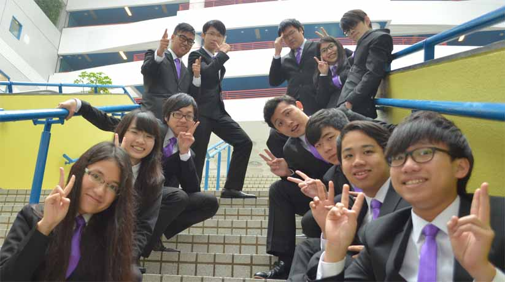

We are RadioActive, the 20th Elected Cabinet of People’s Campus Radio, HKUSTSU, Session 2016-17. The name is chosen because this word is relatively common to people so that people in HKUST can more easily remember the name of this year’s cabinet. More importantly, RadioActive conveys three important meanings.

Firstly, this name is adopted to express our hope that the society will be active and more popular in HKUST. This year, there were various activities for multiple targets, such as general broadcasting for radio members, Live Broadcasting for the public, Orientation Camp for freshmen , New Star Hit for new members and so on. It is sincerely hoped that not only will Executive Committee of the 20th Cabinet actively hold functions, but the all the others can also actively participate in the proposed functions held by People’s Campus Radio. This is also the primary goal of our society this year. To achieve this aim, we will try to inject new elements in the proposed activities so that its uniqueness can have more attraction to the public. Moreover, we will also strengthen our promotion in the campus by various means so that our activities can be known to a wider range of people.

Secondly, we long for an increasing influence of our society in the near future. According to dictionary, radioactive has large energy coming from the breaking up of atoms. It can be spread from a small area to a large city, illustrated by two big nuclear accidents in Chernobyl (1986) and Fukushima (2011). It is hoped that our society can spread our influence from a cabinet to the whole campus of HKUST, bringing enormous change and impact to many people. It is hoped that more people can have a greater sense of belonging and achievement to the society through our activities. Furthermore, our cabinet will endeavour to establish a better relationship with other societies so as to improve the impression of our society and thus have a larger bargaining power when negotiating with others regarding the distribution of resources.

Thirdly, we hope to diffuse our voice into everyone’s heart. In compliance with the nature of our society, the broadcasting held this year has a wide variety of themes and to person-in-charges. Studying in a tense and stressful environment, students have great needs to have relaxation to relieve pressure. It is hoped that our broadcasting programmes can bring fun and joy to both Disc Jockeys and audience. Apart from entertainment purpose, it is also hoped that our programmes can convey meaningful messages to others. The contents of the programmes may not be applicable to everyone but we hope that these programmes can influence perception or trigger responses from the audience.

RadioActive reflects our goals this year. It is hoped that every Executive Committee member can do the best to contribute to the society. Hopefully, the proposed activities can be successfully held and attract more people to pay attention to our society.

### The 20st Cabinet of People's Campus Radio, HKUSTSU (2016-2017)

- President - WONG Yuk Ming (Doctor)
- Internal Vice President - WONG Wing San (Sunny)
- External Vice President - CHO Hoi Ki (Kiki)
- Financial Secretary - NG Charles (Charles)
- Internal Secretary - LEUNG Ho Ling (Melody)
- External Secretary - LAI Hok Wai (Thomas)
- Marketing Officer - NG Ka Ming (嘉明)
- Promotion Director - KONG Wai Kiu (Gillian)
- Programme Director - HUI Ka Wai (Ben)
- Production Director - WONG Hoi Ho (Kelvin)
- General Technical Officer - CHAN Hiu Lok Felix (Felix)
- Team Manager - WONG Ka Wai (Kawaii)
